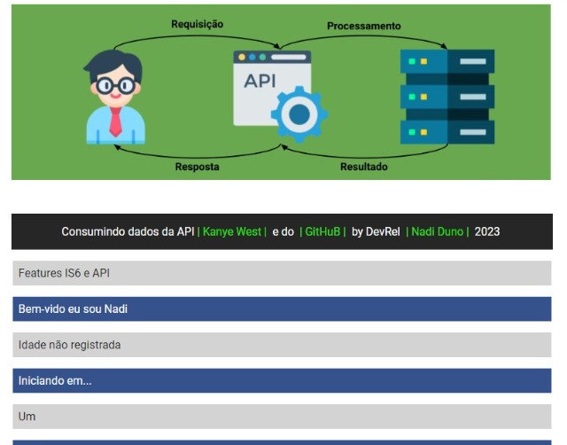

[](https://portfolio-nadi.vercel.app/)
[](https://twitter.com/nadiduno)
[](https://www.linkedin.com/in/nadiduno/)
<br />
<br />
<br />
<div align="center">
  
  <br />
</div>
<br />
<div align="center">
  
  <br />
</div>

[](https://portfolio-nadi.vercel.app/)

<br/>
[JavaScript](https://developer.mozilla.org/en-US/docs/Web/JavaScript) |
[Vite](https://vitejs.dev/) |
[Node](https://nodejs.org/en/download/) |
[NPM](https://www.npmjs.com/)

<br />

```bash
#Set up project
$ npm create vite@latest

# Install the dependencies
$ npm i

# Run the developer
$ npm run dev
```

```bash
#Template Literals and Interpolation
const nameUser = 'Nadi';
return(`Bem-vido eu sou ${nameUser ? nameUser : 'visitante'}`);

#Nullish Caoalescing Operator
return((ageUser ?? 'Idade não registrada'));

#Rest Parameter
function writeDinamic(...dataUser){
  dataUser.forEach((dataUser) => {
    writeDinamic(dataUser);
  }
}

#Async - Promise - API
async function apiQuoteKanyeWest(){
    try{
        const response = await fetch('https://api.kanye.rest');
        const body = await response.json();
        console.log(body);
        return (body.quote);
    } catch(err){
        console.log(err);
    } finally {
        console.log('End');
    }
}

#Destructuring 
function destrucGitHub(){
    const {location,login: Nickname,blog : Site}=body;
    return (Object.entries({location,Nickname,Site}));
}

```

Link da aplicação --> https://vite-java-script.vercel.app/

DevRel :heart: [Nadi Duno](https://www.linkedin.com/in/nadiduno/) © 2023
